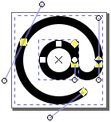
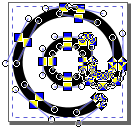
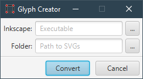

#  glyph-creator
This tool modifies SVG files to use them as font glyphs for font creation.
It converts all strokes to paths and combines all objects in each file.
This is useful e.g. if you want to work with an app like [Icomoon](https://icomoon.io/app/#/projects).

## SVG Modification
The operations could be described as:
1. **Select all** objects and
1. convert them from **strokes to paths**.
1. Then **combine all** and
1. **save** the result to the same file.

| raw                    | before                    | after                    |
| ---------------------- | ------------------------- | ------------------------ |
|  |  |  |

([at-sign](https://github.com/feathericons/feather/blob/v4.28.0/icons/at-sign.svg)
from [Feather Icons](https://feathericons.com/)
([GitHub](https://github.com/feathericons/feather)),
licensed under the [MIT License (MIT)](https://opensource.org/licenses/MIT),
Copyright (c) 2013-2017 Cole Bemis,
[LICENSE](https://github.com/feathericons/feather/blob/master/LICENSE))

## Screenshots

## How to use

### Dependencies
This program requires at a minimum:
- the installation of [Inkscape version 1.0+](https://inkscape.org/release/)
- the installation of [Java 8 or higher to run Gradle](https://docs.gradle.org/current/userguide/installation.html#sec:prerequisites)

### Running
1. Just run the following command from the command line:
for **Linux / macOS** users it's `./gradlew run` for **Windows** users it's `.\gradlew.bat run`.
2. Select the path for the inkscape commandline tool
(under **Linux / macOS** it's `inkscape`, under **Windows** it's `inkscape.com` or `inkscape.exe`).
3. Select the folder with the SVG files to convert.
(Be sure that there are only those you really want to modify! And watch out for subfolders because their SVG files get converted too!)
4. Then click the `Convert` button.
